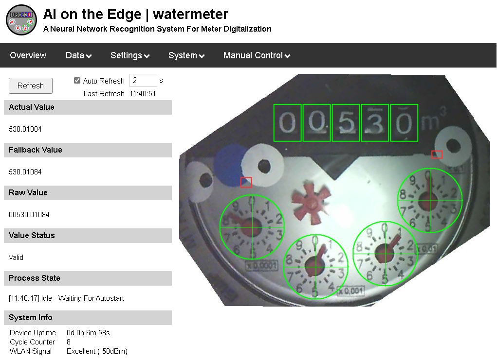
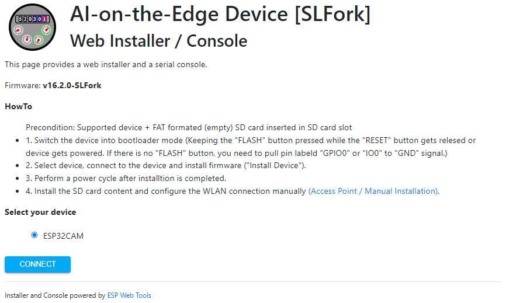

# AI-on-the-Edge device [SL Fork]
 

Artificial intelligence is everywhere, from speech to image recognition. While most AI systems rely on powerful processors or cloud computing, **edge computing** brings AI closer to the end user by utilizing the capabilities of modern processors.  
This project demonstrates edge computing using a low-cost, AI-capable Espressif SOC device (e.g. **ESP32**), to digitize your analog meters — whether water, gas or electricity. With affordable hardware and simple instructions, you can turn any standard meter into a smart device.

Let's explore how to make **AI on the Edge** a reality!

## Key features
- Tensorflow Lite (TFLite) integration – including easy-to-use wrapper
- Inline image processing (Image taking, Image alignment, ROI extraction, Post processing)
- Usage of **small** and **low-cost** devices ([Supported Hardware](#supported-hardware))
- Integrated camera and illumination (depending on hardware)
- Web interface for administration and control
- OTA interface for updating directly via web interface
- Full integration into [Home Assistant](docs/API/MQTT/home-assistant-discovery.md)
- InfluxDB v1.x + v2.x
- [MQTT v3.x](docs/API/MQTT/_OVERVIEW.md)
- [REST API](docs/API/REST/_OVERVIEW.md)
- [Prometheus/OpenMetrics exporter](docs/API/Prometheus-OpenMetrics/_OVERVIEW.md)

## Workflow
The device takes an image of your meter at a defined interval. It extracts the Regions of Interest (ROIs) from the image and runs them through artificial intelligence. 
As a result, you get the digitized value of your meter. There are several options for what to do with that value. Either send it to a MQTT broker, write it to InfluxDB or simply provide access to it via a REST API (JSON / HTML).

 

## Impressions
### Hardware
 

### Web Interface
 

## Supported Hardware
| Board Type                                                                     | SOC      | Firmware Release | Remarks                       
|:---                                                                            |:---      |:---           |:--- 
| [ESP32-CAM](http://www.ai-thinker.com/pro_view-24.html)                        | ESP32    | All           | - Only boards with >4MB RAM are supported - Beware of inferior quality Chinese clones
| [XIAO ESP32 Sense](https://www.seeedstudio.com/XIAO-ESP32S3-Sense-p-5639.html) | ESP32S3  | $\ge$ v17.0.0 |- No onboard illumination: Separate illumination (PWM controlable LED / Intelligent LED) necessary - Running quite hot, small heat sink recommended

## Inform Yourself
There is growing [documentation](https://jomjol.github.io/AI-on-the-edge-device-docs/) which provides you with a lot of information. Head there to get a start, how to set it up and configure it. 
⚠️ Not every description is 100% suitable for this fork. Therefore please check `docs` folder of this repository for any fork specific documentation.

Small selection of youtube videos which might give you an idea how to getting started: [Video 1](https://www.youtube.com/watch?v=HKBofb1cnNc), [Video 2](https://www.youtube.com/watch?v=yyf0ORNLCk4), [Video 3](https://www.youtube.com/watch?v=XxmTubGek6M), [Video 4](https://www.youtube.com/watch?v=mDIJEyElkAU), [Video 5](https://www.youtube.com/watch?v=SssiPkyKVVs), [Video 6](https://www.youtube.com/watch?v=MAHE_QyHZFQ), [Video 7](https://www.youtube.com/watch?v=Uap_6bwtILQ)

## Firmware installation

There are multiple options to install the firmware and the SD card content.

### Download Firmware Package
Officially released firmware packages can be downloaded from [releases](https://github.com/slider0007/AI-on-the-edge-device/releases) page. 
A possibly already available development version (upcoming release version) can be previewed [here](https://github.com/Slider0007/AI-on-the-edge-device/pulls?q=is%3Aopen+is%3Apr+label%3A%22autorelease%3A+pending%22).

### Option 1: Web Installer (Only For Released Versions)

#### Step 1: Install MCU Part Of Firmware

Follow the instructions listed at [Web Installer](https://slider0007.github.io/AI-on-the-edge-device/) page:

 

#### Step 2: Installation Of SD Card Content

Please follow the instructions in the following chapter ["Installation Of SD Card Content"](#step-2-installation-of-sd-card-content).

---
### Option 2: Manual Installation (MCU + SD Card)

#### Step 1: Installation Of MCU Part Of Firmware

Initially the MCU of the device has to be flashed via a USB / serial connection. 
Use content of `AI-on-the-edge-device__{Board Type}__*.zip`.

<b>IMPORTANT:</b> Make sure to use correct firmware package for your board type.

There are different ways to flash the microcontroller:
- [Espressif Flash Tool](https://www.espressif.com/sites/default/files/tools/flash_download_tool_3.9.5.zip) 
- [ESPtool (command-line tool)](https://docs.espressif.com/projects/esptool/en/latest/esp32/esptool/index.html)

Check readme file in firmware package and [documentation](https://jomjol.github.io/AI-on-the-edge-device-docs/Installation/#manual-flashing) for further details.

#### Step 2: Installation Of SD Card Content
A SD card is mandatory to operate the device because of internal device memory is insufficient to handle all necessary files. Therefore the SD card needs to be preloaded with some file content to be able to operate the device. 

⚠️ Make sure, SD card is formated properly (FAT or FAT32 file system). 

Use firmware package `AI-on-the-edge-device__{Board Type}__*.zip` for installation process. 
⚠️ Do not use github source files, use only release related zip package. Otherwise functionality cannot be fully guaranteed or is limited! 

##### Option 1: Manual SD Card Installation
- Copy complete `config` and `html` folder of `AI-on-the-edge-device__{Board Type}__*.zip` to SD card root folder
- Copy file `config/template/config.json` to `config` folder
- Configure WLAN and credentials
- Insert SD-card to device and boot device

##### Option 2: Access Point --> See [documentation](https://jomjol.github.io/AI-on-the-edge-device-docs/Installation/#remote-setup-using-the-built-in-access-point) for details
- Connect to device's WLAN hotspot [http://192.168.4.1](http://192.168.4.1) (Channel 11 | Open network)
- Configure WLAN and credentials
- Upload firmware package (Use `AI-on-the-edge-device__{Board Type}__*.zip`)
- Reboot device

## API Description
### REST API
See [REST API Documentation](docs/API/REST/_OVERVIEW.md) in github repository or via device web interface (`System > Documentation > REST API`). 
⚠️ Read API documenation carefully. REST API is not fully compatible with jomjol's original firmware.

### MQTT API
See [MQTT API Documentation](docs/API/MQTT/_OVERVIEW.md) in github repository or via device web interface (`System > Documentation > MQTT API`). 
⚠️ Read API documenation carefully. MQTT API is not fully compatible  with jomjol's original firmware.

## Build Yourself
See [Build / Debug Instructions](code/README.md)

## Support
⚠️ This is a forked version of [jomjol´s great software](https://github.com/jomjol/AI-on-the-edge-device) which is intented to use for my personal purposes only.
