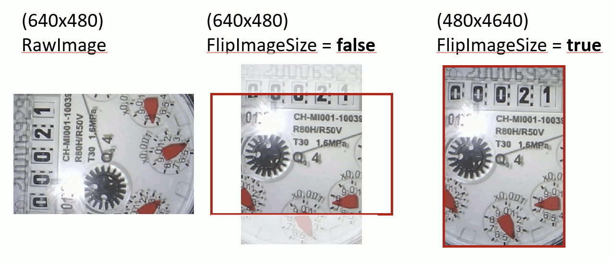

# Parameter: Flip Image Size

|                   | WebUI               | Config.ini
|:---               |:---                 |:----
| Parameter Name    | Flip Image Size     | FlipImageSize
| Default Value     | `false`             | `false`
| Input Options     | `false` `true`   | `false` `true` 

!!! Warning
    This is an **Expert Parameter**! Only change it if you understand what it does!  

## Description

This parameter can be used to rotate the viewport together with the alignment rotation:  
 
  

!!! Tip
    This parameter should be set on the 'Reference Image' configuration page.
    There you have a visual feedback.
